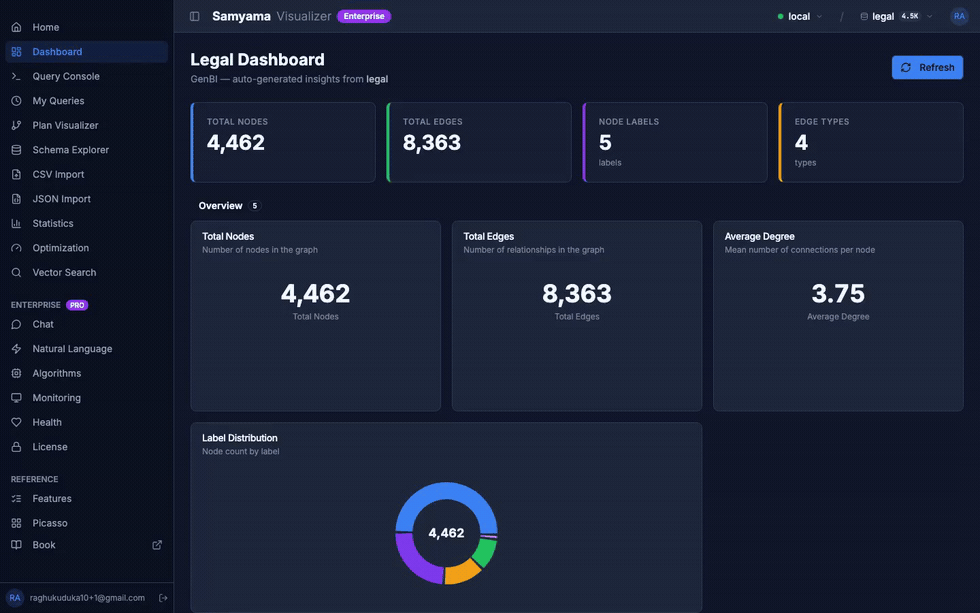

# Legal Judgments Knowledge Graph — Case Study

589 judgments of the Supreme Court of India (2016) — judges, parties, cited legal
sections and topics modelled as a property graph. Questions a legal researcher would
ask ("which sections are cited most?", "which judges sit together most often?", "which
laws span the widest range of subjects?") become single Cypher traversals.

Reproduces a public reference demo (PostgreSQL + Apache AGE + pgvector) by Shreyas Rao
on Samyama — one engine instead of three.

## Live on graph.samyama.cloud

The same 589-judgment graph, loaded into the hosted **Samyama Visualizer** (Enterprise) at
[graph.samyama.cloud](https://graph.samyama.cloud): the dashboard reports the graph at a glance
(4,462 nodes · 8,363 edges · 5 labels · 4 edge types), and the query console runs live Cypher with
interactive, force-directed graph exploration — including full-screen network views. One engine —
no Postgres + Apache AGE + pgvector stack to operate, and no ETL between three systems.



*Full-resolution screen recording: [`cloud-demo.mp4`](cloud-demo.mp4).*

### Terminal quick-look


```bash
cd case_studies/legal-judgments && ./run.sh   # validate every query against the snapshot
RECORD=1 ./run.sh                              # also regenerate demo.gif
```

## The graph

**Scale:** 4,462 nodes · 8,363 edges (imported from a small snapshot in seconds)

| Node label | Count | Key properties |
|------------|-------|----------------|
| Topic | 2,291 | text, category |
| Party | 1,102 | name |
| Case | 589 | id, title, year, month |
| Act | 446 | name |
| Judge | 34 | name |

**Relationships (4):**

| Relationship | Pattern | Count |
|---|---|---|
| `ABOUT` | Case → Topic | 3,041 |
| `CITES` | Case → Act (property: `section`) | 2,749 |
| `PARTY_IN` | Party → Case (property: `role`) | 1,309 |
| `DECIDED` | Judge → Case | 1,264 |

The `section` lives on the `CITES` edge, so section-level questions
("how many judgments cite IPC §302?") are answerable — reproducing the reference's
headline result exactly.

## Benchmark — head-to-head vs Apache AGE

The same 4,462-node graph was loaded into **both** Samyama and Apache AGE (`apache/age`, AGE 1.7.0 on
PostgreSQL 18.1) on the same machine, and the same queries run against each — median of 40 warm
round-trips (Apache AGE via a persistent psycopg2 connection; Samyama via HTTP):

| Query | Apache AGE | Samyama | Samyama is |
|---|---|---|---|
| Judges by case count | 34 ms | **0.94 ms** | **36× faster** |
| Most-cited sections | 23 ms | **1.5 ms** | **15× faster** |
| Laws by topic breadth (2-hop) | 155 ms | **19 ms** | **8× faster** |
| Co-sitting judges (2-hop) | 25 ms | **16 ms** | **1.5× faster** |

**Why:** Apache AGE runs Cypher *inside* PostgreSQL via a `cypher('graph', $$…$$)` function, so Postgres
parses and plans the query **from scratch on every call** — `EXPLAIN ANALYZE` shows planning 8.7 ms +
execution 5.5 ms, i.e. most of AGE's time is planning, repeated each call. Samyama parses once and caches
the plan (a warm query is just execution), and executes over a native in-memory graph rather than
translating Cypher → SQL over Postgres rows. The gap is largest on aggregation-heavy queries (15–36×) and
narrows to 1.5× on the 2-hop join, where both engines do real traversal work.

*Method: same host, warm connection, median of 40 round-trips; two client transports (Postgres binary vs
HTTP). A like-for-like local comparison at this dataset size — not a large-scale benchmark.*

**What this means for a scaling workload**

- **One engine, not three.** The reference stack needs PostgreSQL + Apache AGE (Cypher) + pgvector
  (semantic search). Samyama does graph, vector and analytics in a single process — fewer moving parts,
  one query language, no cross-system ETL.
- **The gap compounds with query volume.** Apache AGE re-plans every `cypher()` call, so its per-query
  cost stays roughly fixed no matter how often the query runs; Samyama caches the plan and executes over a
  native in-memory graph, so repeated and analytics-heavy workloads compound the 8–36× advantage.
- **Interactive by default.** The same graph is explorable live on
  [graph.samyama.cloud](https://graph.samyama.cloud) (see above) — the sub-millisecond reads are exactly
  what make that force-directed exploration feel instant.

## Benchmark — vector search vs pgvector

The reference stack uses **pgvector** for semantic search. To compare k-NN *search speed*, we
loaded the *same synthetic vectors* — at dimensions **128** and **768** (standard sizes in Samyama's
own [`vector_benchmark`](../../benches/vector_benchmark.rs) suite) — with an HNSW + cosine index into
both **PostgreSQL 17 + pgvector** and **Samyama**, and ran identical k-NN queries (k = 10, median of
40 warm queries). This isolates search latency; it is **not** a semantic-quality test, and the vectors
are not embeddings of the judgments.

| Dim | Vectors | pgvector (server compute) | pgvector (client, over TCP) | Samyama (embedded) |
|---|---|---|---|---|
| 128 | 589 | 0.135 ms | 0.561 ms | **0.090 ms** |
| 128 | 10,000 | 0.869 ms | 1.557 ms | **0.253 ms** |
| 768 | 589 | 1.244 ms | 2.166 ms | **0.473 ms** |
| 768 | 10,000 | 1.867 ms | 2.978 ms | **0.993 ms** |

**Read honestly:**

- **On pure search compute, Samyama is faster in every case** — from **1.5×** (dim 128, 589) to
  **3.4×** (dim 128, 10k). The gap is widest at lower dimension / larger corpus and narrows to **1.9×**
  at dim 768 / 10k, where pgvector's SIMD-optimized distance compute is strongest.
- **Real-world the gap is 3–6×**, because pgvector runs *inside* PostgreSQL and is reached over the
  network on every query (client latency includes the TCP hop, even on localhost). Samyama can run
  **embedded (in-process)**, skipping the hop — or as a service (HTTP/RESP) when needed.
- **One engine, not a separate service** — one engine for graph *and* vectors, versus a three-part
  PostgreSQL + Apache AGE + pgvector stack.

Together with the graph benchmark above (8–36× vs Apache AGE), the takeaway is a **single engine for
graph *and* vectors**.

*Method: identical synthetic vectors in both engines (dims 128 & 768, matching Samyama's
`vector_benchmark` dimension set); HNSW cosine (pgvector `hnsw`, `ef_search = 100`); k = 10; median of
40 warm queries; single host. pgvector via psycopg2 (server-side time isolated with `EXPLAIN ANALYZE`);
Samyama via the embedded SDK — the same in-process timing model as Samyama's published LDBC results.
Measures k-NN search latency, not embedding quality.*

## Showcase queries

See [`queries.cypher`](queries.cypher). Every query passes the **Definition-of-Done gate**
(the build fails if any returns zero rows), so nothing in the demo is staged:

| # | Query | Result | Gate |
|---|---|---|:---:|
| 1 | Most productive judges | Dipak Misra — 104 | ✅ |
| 2 | Most-cited legal sections | IPC §302 — 57 | ✅ |
| 3 | Judges who most often sit together | Kurian Joseph & Rohinton F. Nariman — 55 | ✅ |
| 4 | Laws cited together | Indian Evidence Act + IPC — 21 | ✅ |
| 5 | Laws spanning the widest range of topics | Constitution of India — all 11 categories | ✅ |
| 6 | Docket by topic category | 11 categories, 3,041 labels | ✅ |

Queries 1–2 match the reference demo's **published numbers exactly**: top judge Dipak Misra
104; IPC §302 cited in 57 judgments; Constitution Article 32 in 36. (Per-query timings are in
the Benchmark table above.)

## Data & license

Source: [`Shreyasrao/Indian-law-supreme-court-judgements-2016`](https://huggingface.co/datasets/Shreyasrao/Indian-law-supreme-court-judgements-2016)
(revision `e928c72019d6`). Originally from the Indian Supreme Court Judgments registry
on AWS Open Data, managed by Dattam Labs.

**License:** CC-BY-4.0.

Snapshot built by [`examples/legal_judgments_loader.rs`](../../examples/legal_judgments_loader.rs)
from the 9 node/edge CSVs, and published as `legal-judgments.sgsnap` on a release.
