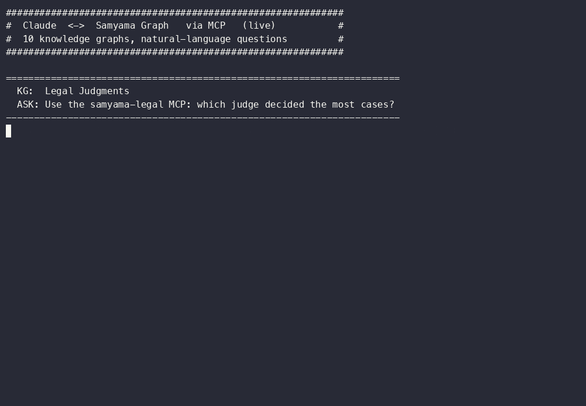

# Claude ↔ Samyama Graph — MCP demo

The code behind the demo video: **Claude answers natural-language questions by talking
to Samyama Graph over MCP**, live, across 10 knowledge graphs. You ask in plain English;
Claude picks the right MCP tool, runs a query on the graph, and returns the answer — no
hand-written per-question scripts.

```
you ──ask──▶ Claude Code ──MCP (stdio)──▶ serve_kg.py ──HTTP :8080──▶ Samyama engine (tenant)
   ◀─answer──                                                          ◀─ query result ─
```

## The recording



Full-quality video: [`samyama-mcp-demo.mp4`](samyama-mcp-demo.mp4) (~25s). Every answer in
it is a real MCP query on the graph, produced by `demo.py` below.

## Files

| File | Role |
|------|------|
| `kgs.yaml` | Single source of truth — the 10 KGs (tenant, repo, tool source, demo question, allowed tools) |
| `serve_kg.py` | Starts one KG's MCP server over stdio, bound to its tenant on a running engine |
| `register.py` | `claude mcp add …` for every KG (user scope) |
| `demo.py` | Runs the live `claude -p` round-trip for each KG (the recorded sequence) |

The **MCP servers themselves** live in each KG repo under `mcp_server/` (curated `config.yaml`);
this folder is only the demo harness. For a **single** graph you don't need `serve_kg.py` at all —
the built-in CLI does it directly:

```bash
samyama-mcp-serve --graph legal --url http://localhost:8080 --config <repo>/mcp_server/config.yaml
```

`serve_kg.py` wraps that CLI to add two things: driving **many** KGs from one `kgs.yaml`, and the
one KG (AssetOps) that ships a **code-based** server instead of a `config.yaml`.

## Install

```bash
pip install -r requirements.txt   # samyama (client + samyama_mcp + samyama-mcp-serve) + PyYAML
```

Also needs the **Claude Code CLI** (`claude`) on `PATH`.

## Quickest run — self-contained (no engine, no KG repos)

The CLI ships a built-in dataset, so you can see Claude ↔ Samyama over MCP with one command:

```bash
claude mcp add social -- samyama-mcp-serve --demo social   # 35 auto-generated tools, embedded
# start a new Claude session, then ask: "Who works at TechCorp, and which cities do they live in?"
```

## Full demo — the 10 KGs

Prerequisites: a running Samyama engine (HTTP `:8080`) with each KG's tenant imported, and the
KG repos cloned into one folder. Each KG is a public repo at `github.com/samyama-ai/<repo>`.

```bash
# 1. clone the KG repos you want into one folder; point SAMYAMA_WS at it (load each tenant into your engine)
export SAMYAMA_WS=~/samyama-kgs
git -C "$SAMYAMA_WS" clone https://github.com/samyama-ai/legal-judgments-graph-kg.git
#   ... repeat for cricket-kg, football-kg, etc.

# 2. register the MCP servers with Claude Code
python register.py             # or a subset: python register.py legal cricket

# 3. start a new Claude Code session (MCP servers load at session start), then:
python demo.py                 # all KGs, or: python demo.py legal cricket
```

Override defaults with environment variables:

| Variable | Default | Meaning |
|----------|---------|---------|
| `SAMYAMA_URL` | `http://localhost:8080` | engine HTTP endpoint |
| `SAMYAMA_WS` | current directory | folder holding the cloned KG repos |
| `PYTHON` | current interpreter | interpreter Claude uses to launch servers |

## The 10 knowledge graphs

| KG | Tenant | Example question | Tool source |
|----|--------|------------------|-------------|
| Legal Judgments | `legal` | which judge decided the most cases? | curated |
| Football / World Cup | `football` | which countries hosted the most World Cups? | curated |
| Cricket | `cricket` | top 3 run scorers of all time? | curated |
| Bank Model Risk | `bank` | which 3 models have the most validation findings? | auto (schema) |
| Industrial AssetOps | `industrial` | if Boiler-1 fails, what does it impact? | code-based server |
| Disease Surveillance | `surveillance` | which 3 diseases have the most reports? | auto (schema) |
| Drug Interactions | `druginteractions` | which 3 drugs interact with the most genes? | curated |
| Biological Pathways | `pathways` | which 3 proteins are in the most pathways? | curated |
| Health Determinants | `health-determinants` | which 3 countries have the highest GNI per capita? | curated |
| Health Systems | `health-systems` | how many countries are in the graph? | curated |

## Honest notes

- These 10 run comfortably on a laptop-class engine. Very large KGs (e.g. PubMed,
  Clinical Trials, IMDb) are **not** included here — they need more memory than a local
  container to load, not a limitation of the MCP integration.
- "Tool source" reflects reality per repo: **curated** = the repo ships a
  `mcp_server/config.yaml`; **auto** = tools are generated from the live schema
  (`ToolConfig()`); **code-based** = the repo (AssetOps) ships its own FastMCP server,
  which `serve_kg.py` points at the running engine.
